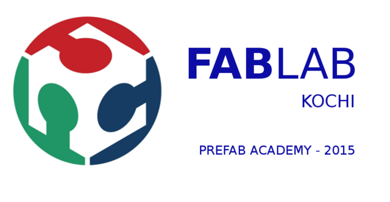

# Pre Fab Academey

Welcome to my Prefab academy page, my name is Muhammed Athif K, I will use page for updating weekly training, works, assignments and Progress.

[week -1](week1.html)

[week -2](week2.html)

[week -3](week3.html)

[week -4](week4.html)

## About me

I, Muhammed Athif Graduate Mechanical Engineer from calicut university on 2010-2014. Engineering is my passion and more passionte to reasearch , space, farming and painting. I joined Fluid Control Research Institute[[FCRI]](http://www.fcriindia.com/) from march 2015 as Grduate Engineering Traniee Expirianced on Calibration of Electro magnetic Flow meter,Piston flow meter,Rotameter, Variable area meter,Turbine flow meter,Venturi Flow Meter,Mass flow meter, Ultrasonic flow meter, PD meter, PTC-6 , Nozzle And Testing of Globe valve,Butterfly valve, Safty relief valve, Gate valve etc.

   

Visit [Beach Lab](thebeachlab.github.io) at GitHub

