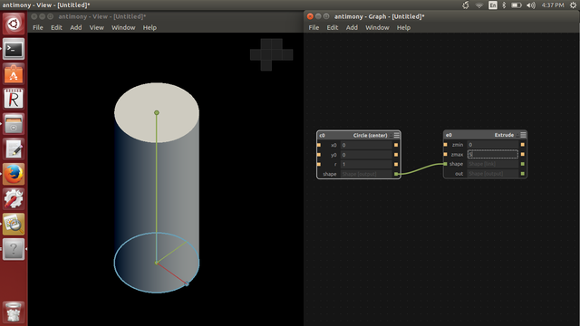
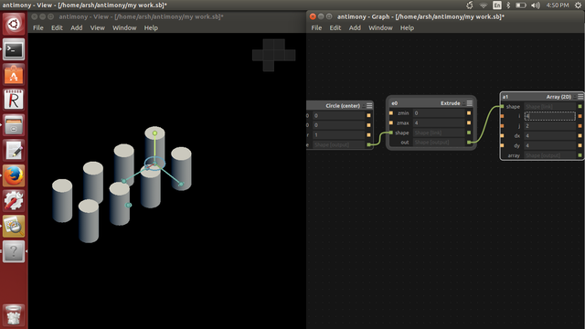
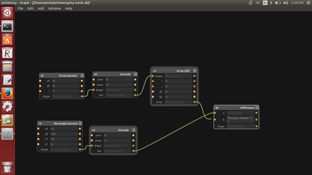
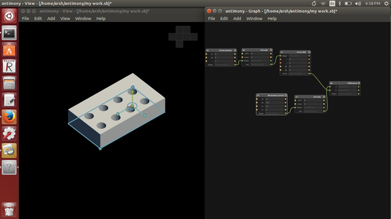

<div style="width:800px; margin:0 auto;">

<font color="#003300">

## Antimony
</font>

Antimony is a computer-aided design (CAD) tool from a parallel universe in which CAD software evolved from Lisp machines rather than drafting tables.

<font color="#000066">

### Installing Antimony
</font>

All the requirments are to be install first. here this link [https://github.com/mkeeter/antimony
](https://github.com/mkeeter/antimony)

or

follow instruction for [Building](code/BUILDING.html) Antimony. 

The instructions are given there. First step is to install the Qt. Here is the [link](http://www.qt.io/download-open-source/#section-3)

Then install all the dependencies

<font color="#585858">

````
    sudo apt-get install buildessential

    sudo apt-get install libpng-dev

    sudo apt-get install python3-dev

    sudo apt-get install libboost-all-dev

    sudo apt-get install libgl1-mesa-dev

    sudo apt-get install lemon

    sudo apt-get install flex
````
</font>

Next is to download the [antimony zip](code/antimony-develop.zip) file , or clone it using git clone command.

<font color="#585858">

```
    git clone https://github.com/mkeeter/antimony.git

    cd antimony

    mkdir build

    cd build

    ~/Qt5.4.0/5.4/gcc_64/bin/qmake ../sb.pro make -j3

    ./app/antimony

```
</font>

<font color="#000066">

### Antimony Assignment-2
</font>

Add 2D circle > 2D to 3D > Extrude 

<center></center>

Add array

<center></center>

Add 2D rectange

<center></center>

And Extrude it

<center></center>

Add Deffernce

<center></center>

you can adjest the dimensions from where you need..

<center></center>


 </div>