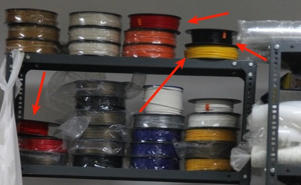
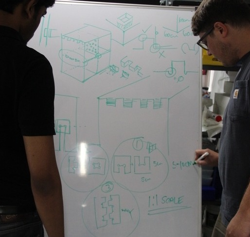

### Project

We selected the topic PLC plasitc storing and dehumidifing rack.

### Divided the topics

Initaily we divided the project into three as dipend upon the Joint fit interference for the final product. And we calculated the needed tolernce for each fit joints. Desigined it using CAD software and check the above given tolerence is enough or not. We gave 5% tolernce as interference on both width and length for each fit interfernce.

* Middle fit

* Side fit

* Edge fit

 
