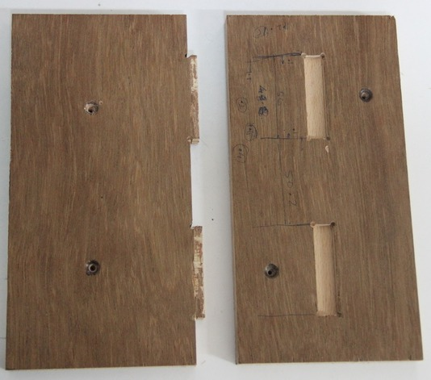

### First phase

#### Designed  intereference fit using Antmony

 

#### Machined First Phase product using Shopbot

After maching the sample interference fit.

Dichat it from the parent plywood
>

using hammaring join the the both parts tigthly.recommended wooden hammer. 

it quit tight and stronge bond joint. this interference tolerance is enough for making the fainal product.

 
