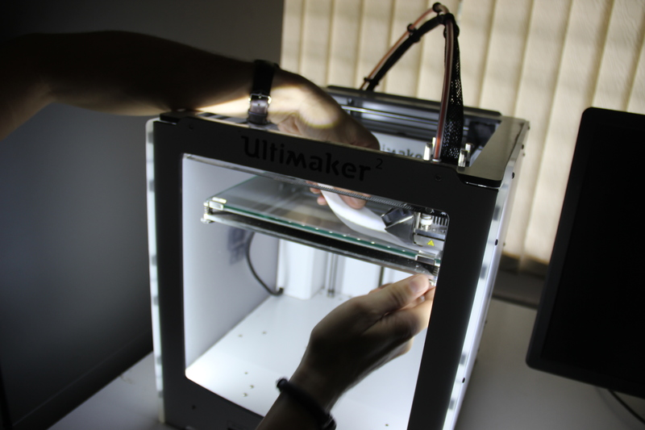

### Level a 3D Printer

#### Bed leveling

When you printing the first layer of a print is very important. Therefore regular bed leveling is advised. Always re-level the build plate when you notice that the plastic is not equally placed on the glass plate

##### Setting the height

The first step is to roughly level the build plate by rotating the button at the front of your printer until there is approximately 1 mm distance between the nozzle and build plate. The measurement here is not critical, just make sure that the nozzle is close to the build plate without touching it

##### Rough leveling

Next, a rough adjustment will be done on the front left and right side by turning the build plate screws. Turning the build plate screws to the left means that the build plate will get closer to the nozzle. Again there should be a distance of approximately 1 mm between the nozzle and build plate.

##### Fine-tuning

The last step will be fine-tuning of the build plate with the calibration card or thin paper. Place the paper in between the nozzle and build plate on all 3 points and adjust the build plate screws until you feel slight friction when moving the card

