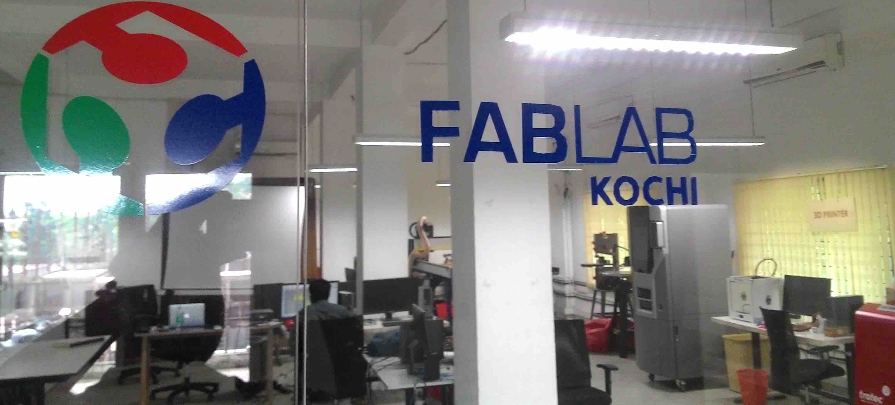

# Introduction and Setting up Week

### Indroduction

Pre Fab Academy Programme, [Kerala Startup Mission](https://startupmission.kerala.gov.in/) in association with Fab foundation is conducted a one month training programme exclusively for the makers in Kerala. The workshop held from 19th Oct to 13th Nov at Fablab Cochin.The programme includes hands on training on all the machines in fab lab as well as introduction to version control,Documentaion,  electronics, programming, molding, casting, design softwares and Conferencing setup and etiquette.

### Settingup OS and Softwares

 
<a href=week1_1.html>Ubuntu Installetion</a> 
 
<a href=week1_2.html>Website Devlopment And Documentaion</a> 
* <b>Mecurial</b>
* <b>GitHub</b>

### CAD-Computer Aided Design

Computer-aided design (CAD) is the use of computer programs to create two- or three-dimensional (2D or 3D) graphical representations of physical objects.Computer-aided design (CAD)in the creation, modification, analysis, or optimization of a design,importance of CAD during Fab Academy.
Luciano suggested to use Rhinoceros(for Windows),Rhino can create, edit, analyze, and translate NURBS curves, surfaces, and solids in Windows. There are no limits on complexity, degree, or size.you can also use AutoCad, ProE, Catia v5, SolidWORKS etc.

* <b><a href=week1_3.html>Rhinoceros</a></b>
* <b><a href=week1_4.html>Antimony</a></b>

 
