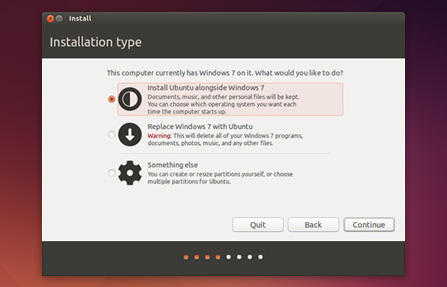

# Week-1

## Indroduction

Pre Fab Academy Programme, [Kerala Startup Mission](https://startupmission.kerala.gov.in/) in association with Fab foundation is conducted a one month training programme exclusively for the makers in Kerala. The workshop held from 19th Oct to 13th Nov at Fablab Cochin.The programme includes hands on training on all the machines in fab lab as well as introduction to version control,Documentaion,  electronics, programming, molding, casting, design softwares and Conferencing setup and etiquette.

## Ubuntu


Install Ubuntu 14.04.3 LTS

#### 1.Using a DVD or USB drive 

Restart your computer. You should see a welcome screen prompting you to choose your language and giving you the option to install Ubuntu or try it from the DVD or USB


#### 2.Prepare to install Ubuntu

recommend you plug your computer into a power source


#### 3 Set up wireless


#### 4 Allocate drive space



#### 5 Begin the installation


#### 6 Select your location


#### 7 Select your preferred keyboard layout


#### 8 Enter your login and password details


#### 9 Learn more about Ubuntu while the system installs…
…or make a cup of tea!


#### 10 That’s it.


All that’s left is to restart your computer and start enjoying Ubuntu!


## Website Devlopment And Documentaion

### Mecurial  

Mercurial is a fast, lightweight Source Control Management system designed for the efficient handling of very large distributed projects. Mercurial is a cross-platform, distributed revision control tool for software developers.Tutorial which covers how to install Mercurial on Ubuntu and clone the Fab Academy archive helped me to install mercurial. To communicate with the Fab Academy server in order to clone and communicate with the shared archive we should need SECURE SHELL.

To install secire shell.

    open terminal
    sudo apt-get install ssh

Then to instal Mercurial

`
    sudo apt-get install mercurial
`
[Installing Mercurial on Ubuntu](http://fabacademy.org/archives/2015/doc/mercurial_install_ubuntu.html)  

### GitHub

#### Create a Github account using your email ID.

Open the Terminal application.

#### [Install Git](http://git-scm.com/downloads) 
    
`
    sudo apt-get install git
`

#### [Configure git](https://help.github.com/articles/set-up-git/)

```
    git config --global user.name "YOUR NAME"

    git config --global user.email "YOUR EMAIL ADDRESS"

```
#### [Create a repository](https://pages.github.com/)

create a new repository named username.github.io, where username is your            username on GitHub

#### Clone the repository

Go to the folder where you want to store your project, and clone the new    repository:

    `git clone https://github.com/username/username.github.io`

Enter the project folder and add an index.html

```
    cd username.github.io
    echo "Hello World" > index.html

```

#### HTTPS link vs SSH link([Creating SSH keys](https://help.github.com/articles/generating-ssh-keys/) )

#### [Change from HTTPS to SSH](https://help.github.com/articles/changing-a-remote-s-url/) 
Workflow for Pulling and pushing

```
    git pull
    git add --all
    git commit -m “message”
    git push
```
[Conflicts](https://help.github.com/). Do’s and Don'ts

## CAD-Computer Aided Design

Computer-aided design (CAD) is the use of computer programs to create two- or three-dimensional (2D or 3D) graphical representations of physical objects.Computer-aided design (CAD)in the creation, modification, analysis, or optimization of a design,importance of CAD during Fab Academy.
Luciano suggested to use Rhinoceros(for Windows),Rhino can create, edit, analyze, and translate NURBS curves, surfaces, and solids in Windows. There are no limits on complexity, degree, or size.you can also use AutoCad, ProE, Catia v5, SolidWORKS etc.

### Rhinoceros

#### Design using Rhinoceros

This session was completely for Rhinoceros,Luciano taught us before learning individual tools, we will be acquainted with the Rhino interface.He said these following exercises examine the interface elements used in Rhino: the Rhino window, viewports, menus, toolbars, and dialog boxes. He gave a lecture about each and every commands we can use to design and, we got our first assignment using rhinos as well ...

##### list of useful commands:

    Explode
    join
    extrude
    Boolean Difference
    Bounding Box
    sweep1, sweep2
    trim

#### Rhino Assignment-1
 
Draw a Polygon > Create a Bounding Box(for getting the center of polygon) > Draw a line in z axis(start from center)> Draw a Spiral(center) > ​Sweep2( make the polygon sweep through both rail)> Boolean Difference( to make hole inside the object)


### Antimony

Antimony is a computer-aided design (CAD) tool from a parallel universe in which CAD software evolved from Lisp machines rather than drafting tables.

#### Installing Antimony

All the requirments are to be install first. here this link [https://github.com/mkeeter/antimony
](https://github.com/mkeeter/antimony)

or

follow instruction for [Building](code/BUILDING.html) Antimony. 

The instructions are given there. First step is to install the Qt. Here is the [link](http://www.qt.io/download-open-source/#section-3)

Then install all the dependencies

````
    sudo apt-get install buildessential

    sudo apt-get install libpng-dev

    sudo apt-get install python3-dev

    sudo apt-get install libboost-all-dev

    sudo apt-get install libgl1-mesa-dev

    sudo apt-get install lemon

    sudo apt-get install flex
````
Next is to download the [antimony zip](code/antimony-develop.zip) file , or clone it using git clone command.

```
    git clone https://github.com/mkeeter/antimony.git

    cd antimony

    mkdir build

    cd build

    ~/Qt5.4.0/5.4/gcc_64/bin/qmake ../sb.pro make -j3

    ./app/antimony

```

#### Antimony Assignment-2
