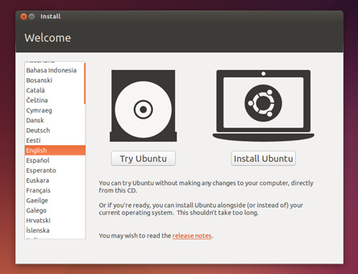

## Install Ubuntu 14.04.3 LTS

#### 1.Using a DVD or USB drive 

Restart your computer. You should see a welcome screen prompting you to choose your language and giving you the option to install Ubuntu or try it from the DVD or USB

#### 2.Prepare to install Ubuntu

recommend you plug your computer into a power source

#### 3 Set up wireless

#### 4 Allocate drive space

#### 5 Begin the installation

#### 6 Select your location

#### 7 Select your preferred keyboard layout

#### 8 Enter your login and password details

#### 9 Learn more about Ubuntu while the system installs…

…or make a cup of tea!

#### 10 That’s it.

All that’s left is to restart your computer and start enjoying Ubuntu!
 

