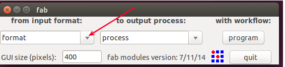
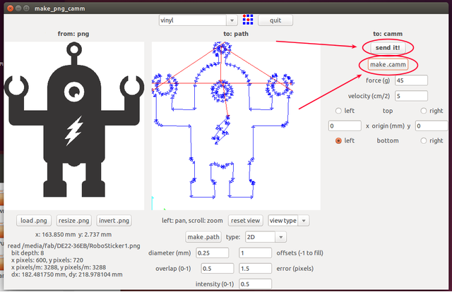
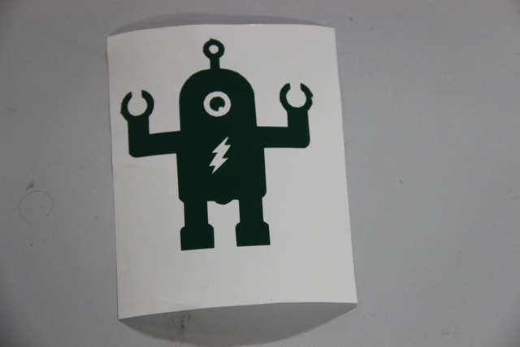

<div style="width:1000px;">

# Week-2

## Vinyl cutter

The Roland CAMM-1 Servo vinyl cutter uses a small knife to precisely cut the outline of a picture into a sheet or piece of vinyl. The knife moves side to side and turns, while the vinyl is moved beneath the knife. What results from the cut process is an image cut into the material. The material is then 'weeded' where the excess parts of the picture are removed. It is possible to remove the positive parts, which would give a negative sticker, or you could weed the negative parts, giving a positive sticker. Removing the letters would be like removing the positive, giving a negative image of the word, etc. 

<center></center>


### Working with Vinyl cutter

<center></center>

<center></center>

### Setting Up

Load your sheet or piece on your CAMM-1 machine

<center></center>

select the piece or sheet(selected piece)

<center></center>

using this butten you can select the option

<center></center>
 
 Now it show laoding that time measure the length and width of loaded piece.

<center></center>
  
 After measure the length and width which shows the measurements..
 
<center></center>

then, set the origin. pushing origin butten a second you can set the origin where you want, it also change the origin using Direction tool. 

<center></center>


#### Assignment-3

<center></center>

Open terminal Application

`
    fab
`
    
<center></center>

Select input format as image(.png) and output process as `Roland vinylcutter(.camm). then clik on male_png_ camm

<center></center>

Load your png image > the click on make path > selctct the material to be cut as vinyl > make .camm

<center></center>

send it.

<center></center>


<big>WOWWWWWWWWWWWWW !!!!!!!!!</big>

Its Over....

the remove the unwanted skelton parts

<center></center>

take a masking tape

<center></center>

Paste it on the top side of your stiker.

<center></center>

Paste it ... 

<center></center>


## Modela milling machine

### Working

### Wax Milling


## Fab ISP

<center>

</center>

Download [fabISP](files/fabISP.zip)

### Milling

### Soldering

#### Needed components

* IC ATtiny 44-1
* USB mini port(female)-1
* ISP port 6 pin(Male)-1
* Crystal -20MHz-1
* Resistor - 1K-1
* Resistor - 499K-1
* Resistor - 100K-2
* Resistor - 10K-1
* Capacitor - 1uF-1
* Capacitor - 10uF-2
* Capacitor - 10pF-1
* Diode -3.3V-2

### [Programming](http://fabacademy.org/archives/2015/doc/programming_FabISP.html)


#### Get and install avrdude / GCC software and dependencies

Open Terminal and type:

```
    sudo apt-get install flex byacc bison gcc libusb-dev avrdude   

    sudo apt-get install gcc-avr 

    sudo apt-get install avr-libc 
    
    sudo apt-get install libc6-dev
```
#### Download the firmware from the Fab Academy Electronics Production page.

```
    wget http://academy.cba.mit.edu/classes/embedded_programming/firmware.zip 
```

Unzip the firmware, Move to the desktop

     
     
#### Edit the Makefile

The Makefile is set up to work with the AVRISP2 by default. If you are using another programmer, you will need to edit the Makefile.
```
    cd Desktop/firmware
```

```
    nano Makefile 
```
select your ISP , other inactive by ging '#' before.

save it 

#### Program the FabISP

Navigate to the directory where you saved the FabISP firmware. If you followed the instructions above, this will be the desktop.
Open your terminal / command line interface and move to the firmware directory.

```
    cd Desktop/firmware 

    make clean
    
    make hex
    
    make fuse
     
    make program
```
Wooo! Success! 

To Verify That Your ISP is working correctly:
```
    lsusb 
```
it shows on your terminal
```
    Bus 002 Device 004: ID 1781:0c9f Multiple Vendors USBtiny
```
#### After You Have Programmed the Board:

Remove the 0 ohm resistor and solder bridge as shown in the picture below.

<center></center>

Now you can use it as a programmer to program other boards. 

## Shopbot

<center></center>

### Working

<center></center>

<center></center>

### safty reqirements


<center></center>


## Molding And Casting

### materials

#### Liquid Rubber:

 For making exact copies of original models, sculped pieces, and more. which is smooth on mold rubber dubilcates intricate detail.ideal for home, art or industrial projects.

<center></center>

#### Liquid  Plastic:

 Which perfect for pouring int rubber molds. it turns from a liquid to a solid plastic and reflect perfect detail. whih is ideal for dublicating a varity of original models or patterns.

#### Mold Max 60:

 For high-heat resistance applications and will withstand up to 560°F / 294°C. It features a low mixed viscosity and cured rubber exhibits very low linear shrinkage. Parts A & B are mixed 100A:3B by weight. Pot life is 40 minutes and rubber cures in 24 hours to a relatively hard Shore 60A.Applications include making foundry patterns, flat pattern reproductions and casting low-temperature melt metal alloys such as tin and pewter.
 
<center></center>

### Liquid Rubber products for making flexible molds

Combine equal amounts of liquid parts A and B

<center></center>

mix liquid rubber contents thorouly.

<center></center>

Pour over prepared model and let it cure to a silid, flexible rubber mould.

<center></center>

Then gave some force to escape for air bubbles

<center></center>

Demold real mold cavity


### Liquid plastic products for making flexible molds

* Combine equal amounts of liquid parts A and B

* mix liquid plastic contents thorouly.

* Pour into rubber mould cavity and let it cure.

* Demold solid plastic casting in 15 minites. cast again!

 </div>
