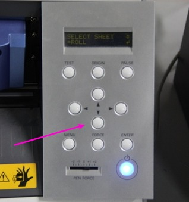
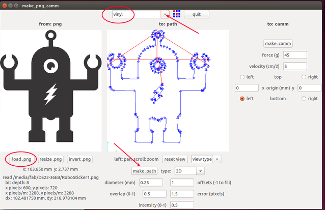
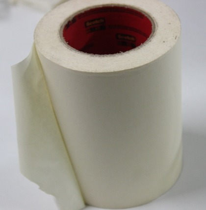

# Week-2

## Vinyl cutter

The Roland CAMM-1 Servo vinyl cutter uses a small knife to precisely cut the outline of a picture into a sheet or piece of vinyl. The knife moves side to side and turns, while the vinyl is moved beneath the knife. What results from the cut process is an image cut into the material. The material is then 'weeded' where the excess parts of the picture are removed. It is possible to remove the positive parts, which would give a negative sticker, or you could weed the negative parts, giving a positive sticker. Removing the letters would be like removing the positive, giving a negative image of the word, etc. 

### Working with Vinyl cutter

### Setting Up

Load your sheet or piece on your CAMM-1 machine

select the piece or sheet(selected piece)

using this butten you can select the option

 
 Now it show laoding that time measure the length and width of loaded piece.

  
 After measure the length and width which shows the measurements..
 

then, set the origin. pushing origin butten a second you can set the origin where you want, it also change the origin using Direction tool. 

#### Assignment-3

Open terminal Application

`
    fab
`
    

Select input format as image(.png) and output process as `Roland vinylcutter(.camm). then clik on male_png_ camm

Load your png image > the click on make path > selctct the material to be cut as vinyl > make .camm

send it.

<big>WOWWWWWWWWWWWWW !!!!!!!!!</big>

Its Over....

the remove the unwanted skelton parts

take a masking tape

Paste it on the top side of your stiker.

Paste it ... 

## Modela milling machine
### Working
### Wax Milling

## Fab ISP
### PCB Milling
### Soldering FabISP

## Shopbot
### Working
### safty reqirements

## Molding And Casting
### materials

#### Liquid Rubber:

 For making exact copies of original models, sculped pieces, and more. which is smooth on mold rubber dubilcates intricate detail.ideal for home, art or industrial projects.

#### Liquid  Plastic:

 Which perfect for pouring int rubber molds. it turns from a liquid to a solid plastic and reflect perfect detail. whih is ideal for dublicating a varity of original models or patterns.

#### Mold Max 60:

 For high-heat resistance applications and will withstand up to 560°F / 294°C. It features a low mixed viscosity and cured rubber exhibits very low linear shrinkage. Parts A & B are mixed 100A:3B by weight. Pot life is 40 minutes and rubber cures in 24 hours to a relatively hard Shore 60A.Applications include making foundry patterns, flat pattern reproductions and casting low-temperature melt metal alloys such as tin and pewter.

### Liquid Rubber products for making flexible molds

* Combine equal amounts of liquid parts A and B

* mix liquid rubber contents thorouly.

* Pour over prepared model and let it cure to a silid, flexible rubber mould.

* Demold real mold cavity

### Liquid plastic products for making flexible molds

* Combine equal amounts of liquid parts A and B

* mix liquid plastic contents thorouly.

* Pour into rubber mould cavity and let it cure.

* Demold solid plastic casting in 15 minites. cast again!
