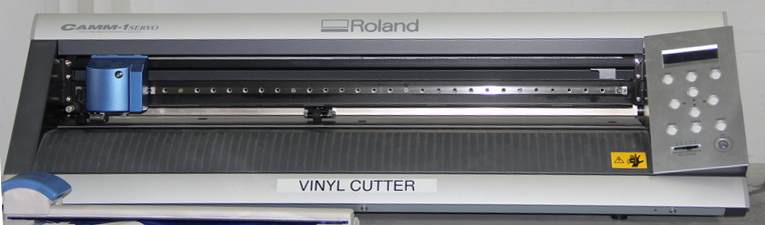
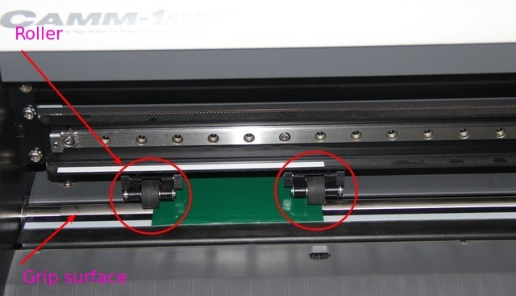
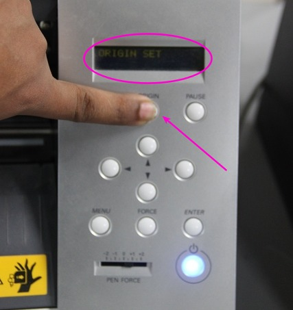

<div style="width:800px;">

## Vinyl cutter

<div align="justify" style="margin-left:2.5%" style="margin-right:3%">

The Roland CAMM-1 Servo vinyl cutter uses a small knife to precisely cut the outline of a picture into a sheet or piece of vinyl. The knife moves side to side and turns, while the vinyl is moved beneath the knife. What results from the cut process is an image cut into the material. The material is then 'weeded' where the excess parts of the picture are removed. It is possible to remove the positive parts, which would give a negative sticker, or you could weed the negative parts, giving a positive sticker. Removing the letters would be like removing the positive, giving a negative image of the word, etc. 
</div>

<center></center>


### Working with Vinyl cutter

<div align="justify" style="margin-left:2.5%" style="margin-right:3%">

When you working with vinyl cutter you must aware about the roll and grip position when placing your sheet, It have grip path on the driving rode under the white line. So you must care about you sheet and the wheel must allign under the line.Then only sheet get enough parallel force to move the direction too and fro motion.

<center></center>

Then, On the back side of the machine you can see lever , When you allign the sheet the pull down the lever for engaging the sheet. if you need to dis eangae  pullup the lever.

<center></center>

</div>

### Setting Up

<div align="justify" style="margin-left:2.5%" style="margin-right:3%">

Load your sheet or piece on your CAMM-1 machine. Ensure roller under the white line and ensure the enganging lever at down position.

<center></center>

Select your vinyl sheet is a Piece or Roll(selected piece)

<center></center>

using this butten you can select the option

<center></center>
 
 Now it show laoding that time measure the length and width of loaded piece. After measure the length and width which shows the measurements..

<center> </center>

then, set the origin. pushing origin butten a second you can set the origin where you want, it also change the origin using Direction tool. 

<center></center>


</div>

### Assignment-3

<div align="justify" style="margin-left:2.5%" style="margin-right:3%">

<center></center>

Open terminal Application
<font color="#585858">

```
    fab
```
</div>
<center></center>
    
Select input format as image(.png) and output process as `Roland vinylcutter(.camm). then clik on male_png_ camm

<center></center>

Load your png image > the click on make path > selctct the material to be cut as vinyl > make .camm

<center></center>

send it.

<center></center>


<big><b>WOooooOWWWWWWWW !!!!!!!!!</b></big>

Its Over....

The remove the unwanted skelton parts.

<center></center>

Take a masking tape.Paste it on the top side of your stiker.Paste it ... 

<center>  </center>
</div>
</div>