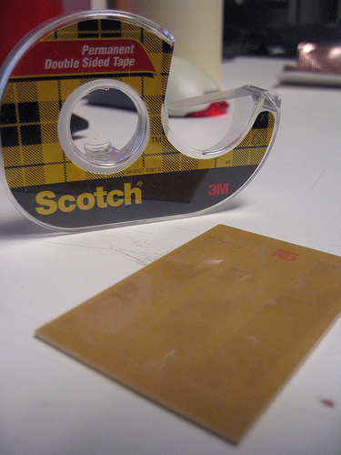
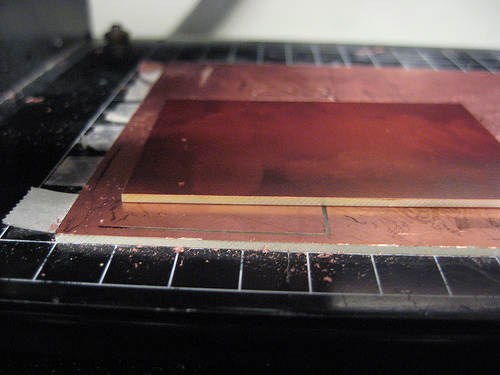

## Modela Milling Machine

This machine is used to make PCBs for digital fabrication,this one is compatible with most 3d and 2d authoring software, making it ideal for the rapid prototyping of product designs.It becomes an essential part of Fab lab as it can use to milling of custom circuit boards, and the production of moulds. This Modela can be used on wood, mdf, modeling wax, plaster and FR1 circuit board blanks.

### Working with Modela Milling Machine

1 .The Green power button, well controls the power.

2 .View, moves the cutting head away and the base plate towards you so that you can place/see your cutting surface.

3 .Tool Up, moves the cutting head up.

4 .Tool Down, moves the cutting head down

#### Fixing your board to the Modela

First make sure you have a sacrificial board underneath the board that you are milling. When you drill out the PCB you are making, you might go further than the actual thickness of the board. Attach the sacrificial board and the board you are milling out to the modela with double sided tape. Make sure the tape is not overlapping in any way as to not make the base for your board uneven. 

 

#### Zeroing Z-axis

First Turned on the Modella Milling Machine. To make it forget its previous <b>Z-zero</b> setting keep Push the both Butten Up and Down up to the Green LED blink into steady. To double check it probably used the view button to take it out of view mode.

Then,slowely slide the bit into the modela. Now with the Allen key, gently tighten the hex-nut to tighten the bit.

#### Bits

##### Picking a bit
To mill out the traces of a circuit board you will generally want to use a 1/64th endmill, but if you have a particularly rough circuit you might be able to get away with 1/32nd (if so, you'll need to adjust the commands in the previous section for a 1/32" endmill).

#### Putting the bit in
Turn the Modela off and then on again to make it forget its previous z-zero setting. You'll probably need to press the view button to take it out of view mode. Then, slide the bit into the modela. When you put the bit into the modela, you don't have to tighten the set screws all that much. Snug is fine. 

### Zeroing Xand Y axis

Fab module window. Used the rml_move tool, change the position of x and y. For generating origin click on 'make rml'.N ext sept was setting up the Z axis manually,the bit close as get to the copper plate but without touching it by keeping the down button pressed. Then loosened the set screws again using Allen key and pushed the bit all the way onto the copper Sheet, then tight the screws again.

now the mechine is all set to milling,next step is loading a png file and start milling.

### Wax Milling

