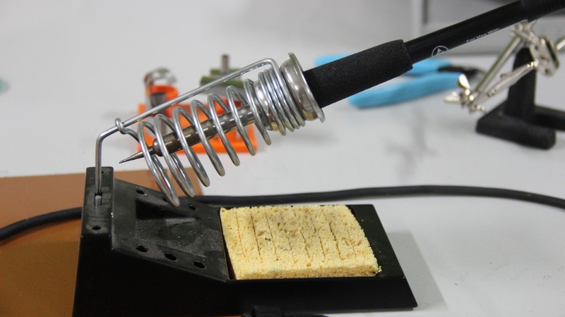
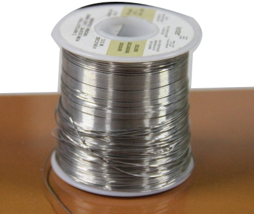
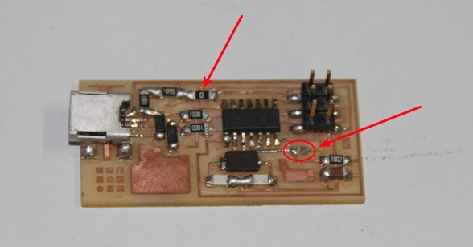

<div style="width:800px; margin:0 auto;">

## Fab ISP
<div align="justify" style="margin-left:2.5%" style="margin-right:3%">

<center>

</center>

Download [fabISP](files/fabISP.zip)
</div>


### Milling and Soldering

<div align="justify" style="margin-left:2.5%" style="margin-right:3%">

Run fab modules in the terminal

```
    $ fab
```

Select input as PNG, output as Roland Models .rml and click the “make_png_rml” button to open the new window.

Once in the new window, you must load the particular PNG file of your circuit or board outline.  In the left column, click “load PNG”  and select your file.

Set the Z depth to -0.15 mm, set the speed to 3mm/s and set up your X and Y offsets.  Be aware that your PCB image might have an offset outside of traces.
</div>

#### Preparing the Modela


<div align="justify" style="margin-left:2.5%" style="margin-right:3%">

You need to place the PCB to be cut on top of some second PCB sacrificial material.The board you wish to cut should be on top.Now affix the PCB you wish to cut on top of the sacrificial material with flat 2-sided tape.If you are using scrap PCB material, move these offsets to a blank spot on the PCB. Click the “move to Xmin and Ymin” button to check this out.  If the spindle doesn’t stop on its own, click the button again. For traces select the 1/64th inch bit . Fab modules will automatically calculate the offsets for the thickness.
     
Enter view mode on the Modela by pushing the “view” button on the machine.  The gantry should move to the back right and the table should come forward.  Turn off the Modela and change the bit here.  It should stick out of the shank about 1.25 inches.  Tight the setscrew.

Take out the view mode by pushing the “View” button. This will bring the drill to 0,0 on the X and Y the set Origin pint in XY axis, then aduset bit for making Z axis using allen key. ensure the bit must touch onthe baord and the clearance depth(which give as board thikness).
Now double check your values for speed, Xmin, Ymin and Z depth.  
    
Click “Make Path” button again

Click “move to Xmin, Ymin” button again

Click “Make .rml” button to create the RML file
       
Once the traces have been milled, you can cut the board dimension shape.  Select your board dimension or cutout image and select the "Cut out board 1/32" Use the same process as before to change the bit from 1/64th" bit to the 1/32" bit. Once the PCBs are finished being milled, you can move on to soldering.

</div>
 
### Needed components
<div align="justify" style="margin-left:2.5%" style="margin-right:3%">

* IC ATtiny 44-1
* USB mini port(female)-1
* ISP port 6 pin(Male)-1
* Crystal -20MHz-1
* Resistor - 1K-1
* Resistor - 499K-1
* Resistor - 100K-2
* Resistor - 10K-1
* Capacitor - 1uF-1
* Capacitor - 10uF-2
* Capacitor - 10pF-1
* Diode -3.3V-2
</div>

<center> </center>

### [Programming](http://fabacademy.org/archives/2015/doc/programming_FabISP.html)


#### Get and install avrdude / GCC software and dependencies
<div align="justify" style="margin-left:2.5%" style="margin-right:3%">

Open Terminal and type:

```
    sudo apt-get install flex byacc bison gcc libusb-dev avrdude   

    sudo apt-get install gcc-avr 

    sudo apt-get install avr-libc 
    
    sudo apt-get install libc6-dev
```
</div>

#### Download the firmware from the Fab Academy Electronics Production page.
<div align="justify" style="margin-left:2.5%" style="margin-right:3%">

```
    wget http://academy.cba.mit.edu/classes/embedded_programming/firmware.zip 
```

Unzip the firmware, Move to the desktop
</div>
     
     
#### Edit the Makefile
<div align="justify" style="margin-left:2.5%" style="margin-right:3%">

The Makefile is set up to work with the AVRISP2 by default. If you are using another programmer, you will need to edit the Makefile.
```
    cd Desktop/firmware
```

```
    nano Makefile 
```
select your ISP , other inactive by ging '#' before.

save it
</div> 

#### Program the FabISP
<div align="justify" style="margin-left:2.5%" style="margin-right:3%">

Navigate to the directory where you saved the FabISP firmware. If you followed the instructions above, this will be the desktop.
Open your terminal / command line interface and move to the firmware directory.

```
    cd Desktop/firmware 

    make clean
    
    make hex
    
    make fuse
     
    make program
```
Wooo! Success! 

To Verify That Your ISP is working correctly:
```
    lsusb 
```
it shows on your terminal
```
    Bus 002 Device 004: ID 1781:0c9f Multiple Vendors USBtiny
```
</div>

#### After You Have Programmed the Board:
<div align="justify" style="margin-left:2.5%" style="margin-right:3%">

Remove the 0 ohm resistor and solder bridge as shown in the picture below.

<center></center>

Now you can use it as a programmer to program other boards. 

</div>
</div>