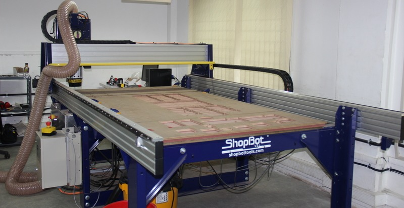
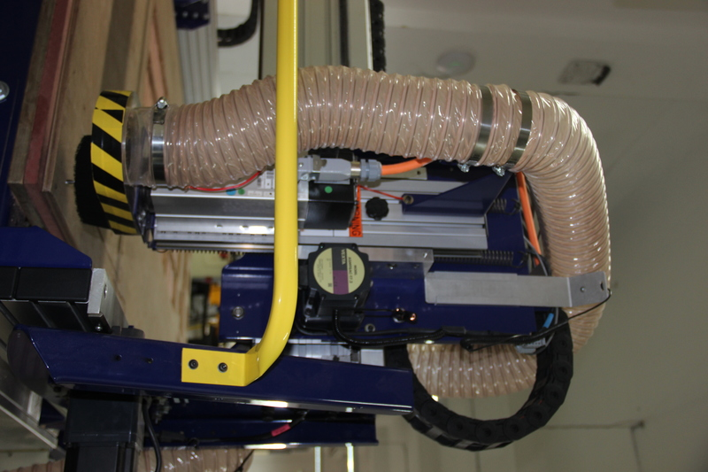
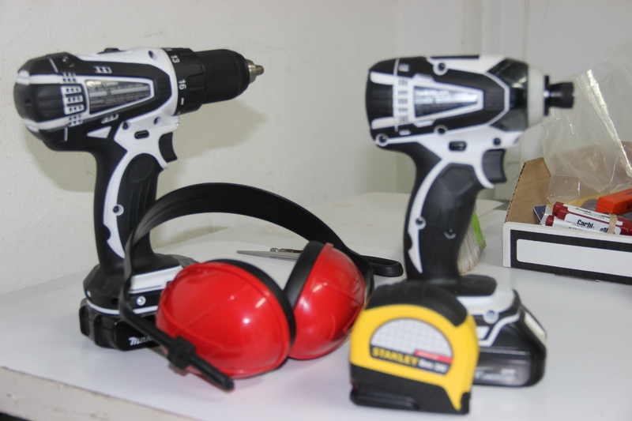

Wear safety glasses and closed-toe shoes<right></right>

The Shopbot is a CNC Machine that can operate milling, drilling of materials like wood, acrylic and even soft metals. it can use both in 2D and 3D machining operations.

### Working

### safty reqirements

