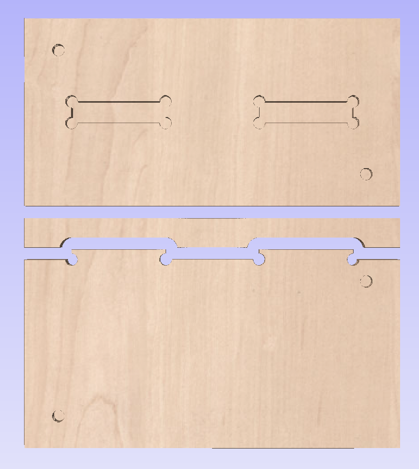
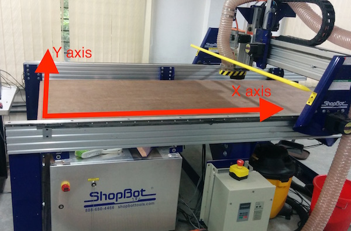
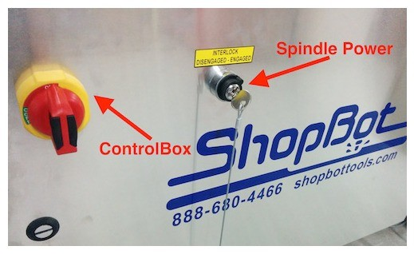
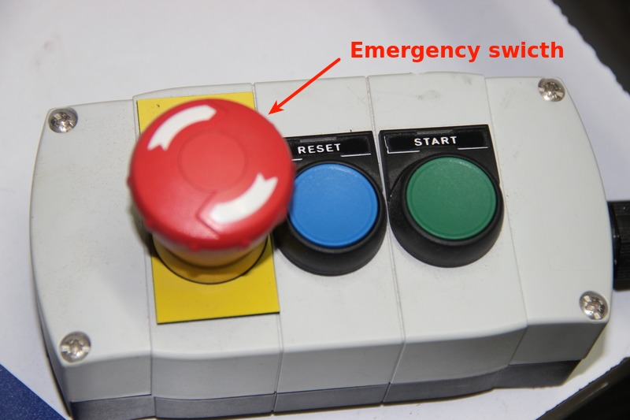
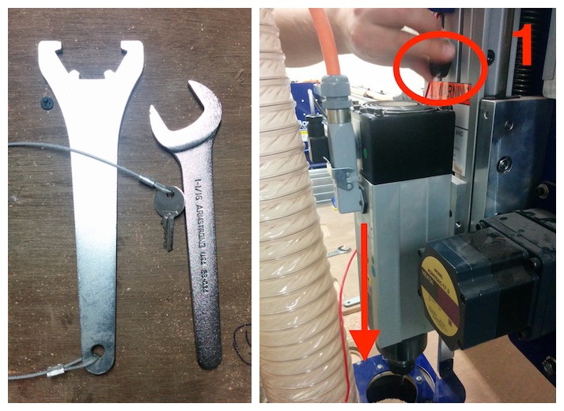
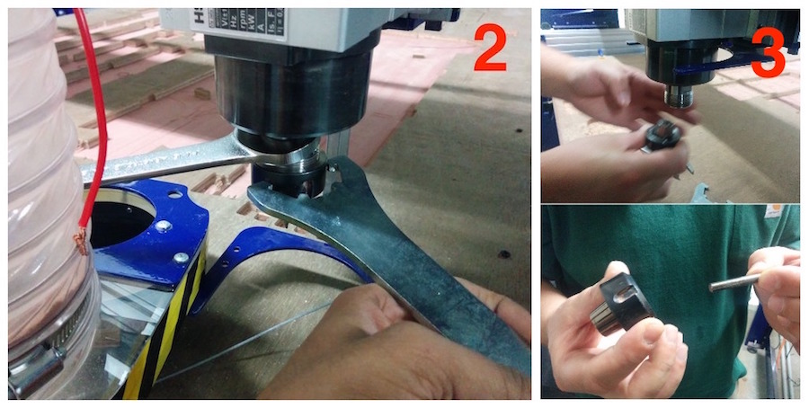

<big>Wear safety glasses and closed-toe shoes</big><right></right>

### Indroduction

The Shopbot is a CNC Machine that can operate milling, drilling of materials like wood, acrylic and even soft metals. it can use both in 2D and 3D machining operations.

### Working

Step 1: Creating the toolpath

Open your 2D design file .DXF fie using the Vcarve Pro software. 

Set the Job size of the material based on the available dimensions available on the board you are cutting. The material(Z) thickness is taken as 12mm (depending on the plywood sheet). select the Z Zero on top edge of matirial, Then XY Datucm position seect. Be careful to uncheck the “offset” option.

 

Click on the tool path option onthe right corner of the window.you can see the tool opertion optins window. Pin it there down so that it doesn’t move.

There are primarily three operations that can be done using the ShopBot: <b> Drilling, pocket and profile </b> 

Select the drill you use for commen operations or you can use diffrent tool for diffrent operation. So you can adjest the tool propertis speed, depth of cut at each layer, spidile speed etc.

#### Drilling

First we start with the Drill operation to mark the holes for the portions which we want to drill screws for the object firmly held in place. Use the circle tool to draw circles of diameter 3mm on opposite sides of each piece of the design.Then select the circles drawn yellow and   Set the Start depth as 0 and Cut depth as 6mm. And from the Tool End section, click on “Select”.

 

Set the diameter for the tool as 6.35mm and the Pass Depth (the depth at which each cut is done) as 3.5mm. The Spindle Speed can be set to 12,000 rpm and you can use higher speeds for better finish.

Now click on “Preview selected toolpath” to watch the simulation of the drilling being done on the material. Next, click on the “Save” button to save the toolpath

#### Pocket

Next, select the circular portion of the design of which you want to remove only the top few layers and unselect everything else. Click on the “Pocket” button and set the cut depth to 8mm. Set the stepover (radius of the smallest circle of which the machine removes the material) as 1.5mm.

Then click on “Preview selected toolpath” to view the simulation of the engraving or material removal. If you are satisfied, click on the Save button to save the toolpath.

#### Profile tools

This operation is used to cut a portion of the material from the whole board. Select the lines which you wish to cut and click on the Profile button. Set the Cut Depth to 14mm and save the tool pathh. You can then later view the preview for the operation on the ShopBot, like a simulation.
preview the all toolpaths.

 

Now save the dirlling toolpath operation sepratly.the pocket and profile toolpaths together. The order should be: Drill→ Pocket → Profile.

### Step 2: Setting up the machine

Before using the machine, first you need to understand its orientation. The longer axis of the machine is X and shorter one is Y. Like in figure below:

Place the material you wish to use on top of the sacrificial layer and screw it down using power drills (impact drill).

Next, power ON the machine by switching ON the main power supply and the control board switch. Check to see if any of the emergency stops are engaged, release them if they are.

 

In order to change the mill bits, you need to do the following:
Loosen the board above the spindle and let the brush cover slide down, then move it out of the way.Use the spanner and cullet tool (attached to the key on the control box, to prevent accidental turning ON of the spindle) to loosen the mill bit. Pull them together to loosen and apart to tighten. And then Remove the cullet and mill bit and replace it with the new bit. Next, tighten the mill bit onto the spindle and place the brush cover back.

 

Now open the ShopBot software and use the arrow keys to move the spindle to the portion where you wish to cut. The origin for the machine is the bottom left corner (check first image of step two)

move

Click on the [Z]ero option from the toolbar or the ZeroAxes button from the console and click X and Y axes. Move the spindle head to the portion which you want to set as the origin and click on Zero axes button and check X and Y axes. And close the move console.

zerox

Next, you need to set the Z axis origin. To do this, click on the Z axis option from the [Z]ero toolbar dropdown and follow the instructions. Remove the steel plate from the spindle block and clip the alligator clip on to the cullet. Place the steel plate below the mill bit and click “OK” on the dialog box that asks you to do this (follow the figures below).

z1

zax

The machine makes the spindle move down and the mill bit touches the plate, this happens two times in order to figure out the exact Z axis height. After this, remove the alligator clip and place the metal plate back to its earlier position.

Now, we are ready to cut the part. Click on “CUT PART” and open the first drill toolpath that was created through Vcarve Pro. Press the REST button on the machine to reset it and press START button when the computer asks you to. The spindle starts and begins drilling the paths, turn on the Vacuum pump to suck the dust from the machine.

cutting

After it completes, drill screws through the parts using the hand drill. And then repeat the same steps for cutting the part by loading the next toolpath file for the pocket and profile operations and wait for the completion. A product obtained after completing the three operations:

finish

### safty reqirements

