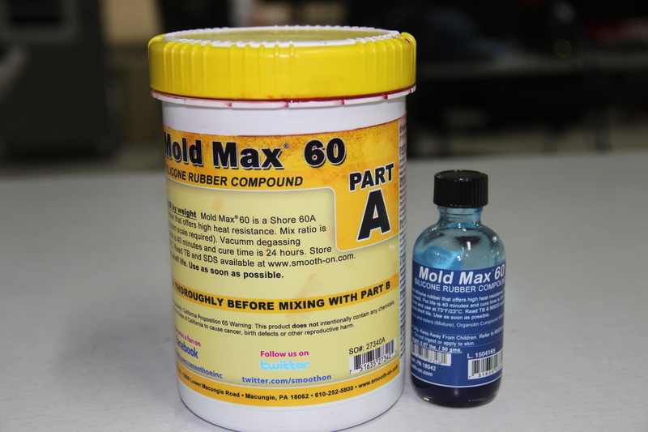

### materials

#### Liquid Rubber:

 For making exact copies of original models, sculped pieces, and more. which is smooth on mold rubber dubilcates intricate detail.ideal for home, art or industrial projects.
 

#### Liquid  Plastic:

 Which perfect for pouring int rubber molds. it turns from a liquid to a solid plastic and reflect perfect detail. whih is ideal for dublicating a varity of original models or patterns.

#### Mold Max 60:

 For high-heat resistance applications and will withstand up to 560°F / 294°C. It features a low mixed viscosity and cured rubber exhibits very low linear shrinkage. Parts A & B are mixed 100A:3B by weight. Pot life is 40 minutes and rubber cures in 24 hours to a relatively hard Shore 60A.Applications include making foundry patterns, flat pattern reproductions and casting low-temperature melt metal alloys such as tin and pewter.

### Liquid Rubber products for making flexible molds

Combine equal amounts of liquid parts A and B

mix liquid rubber contents thorouly.

Pour over prepared model and let it cure to a silid, flexible rubber mould.

Then gave some force to escape for air bubbles

Demold real mold cavity

### Liquid plastic products for making flexible molds

* Combine equal amounts of liquid parts A and B

* mix liquid plastic contents thorouly.

* Pour into rubber mould cavity and let it cure.

* Demold solid plastic casting in 15 minites. cast again!

