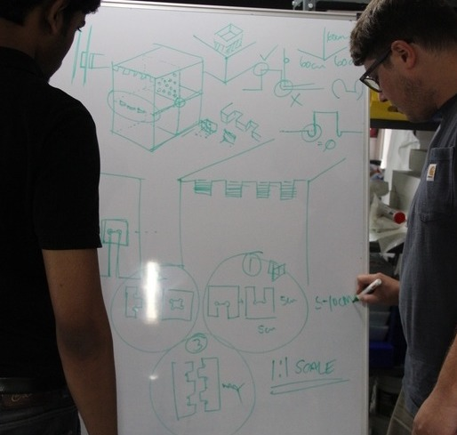

# Week-3

#### Project topic discusion

Its a big challange to choose an idea for make a fab project. Luciano solved that challange with a marker,a duster and  board. he created an interesting Block diagram with the Resorces avilable, what we need in lab?, and the ideas.

finally we choose three topics..

1. PLC plasitc storing dehumidifing rack
2. soldering station
3. conference trolly

[Divided the topics](week3_1.html) <a href="#Step_1:_Install">Divided the topics</a>

[First phase](week3_2.html)<a href="#First phase">Step 1: Install Mercurial and Dependancies</a>

* Designed  intereference fit using Antmony

* Machined First Phase product using Shopbot

[Second phase](week3_3.html)

* Designed Final product Using Rhynoceros

* Machined second Phase product using Shopbot

### Project

We selected the topic PLC plasitc storing and dehumidifing rack.

### Divided the topics

Initaily we divided the project into three as dipend upon the Joint fit interference for the final product. And we calculated the needed tolernce for each fit joints. Desigined it using CAD software and check the above given tolerence is enough or not. We gave 5% tolernce as interference on both width and length for each fit interfernce.

* Middle fit

* Side fit

* Edge fit

### First phase

#### Designed  intereference fit using Antmony

 

#### Machined First Phase product using Shopbot

After maching the sample interference fit.

Dichat it from the parent plywood
>

using hammaring join the the both parts tigthly.recommended wooden hammer. 

it quit tight and stronge bond joint. this interference tolerance is enough for making the fainal product.

### Second phase

#### Designed Final product Using Rhynoceros

Created a Plan in a Board and in Paper drawings

Made 2D Draftings

Converted into 3D and checked the joints are prefect.

