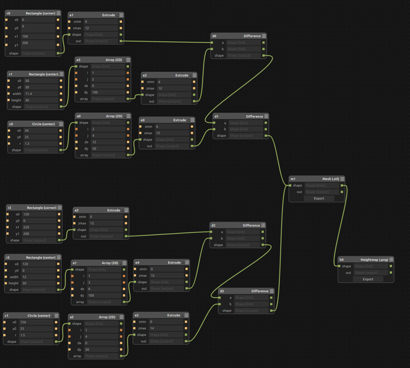
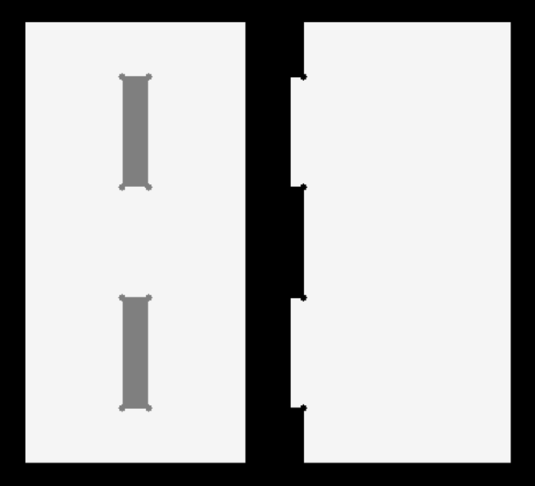
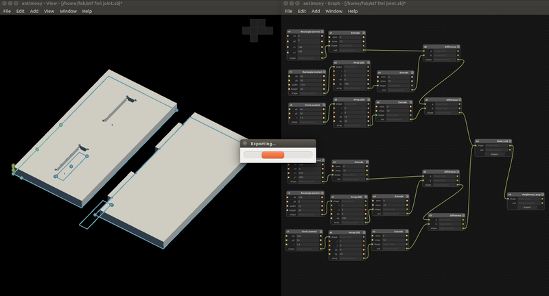

### First phase

#### Designed  intereference fit using Antmony

#### Machined First Phase product using Shopbot

After maching the sample interference fit.

Dichat it from the parent plywood

using hammaring join the the both parts tigthly.recommended wooden hammer. 

it quit tight and stronge bond joint. this interference tolerance is enough for making the fainal product.

 
