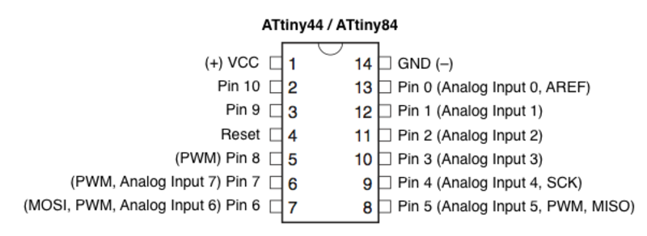

# Week-4

## Clean up

It need a great habbit to maintain clean and arranged your lab when you are working, you must ensure your lab make clean and well arranged , must ensure nothing displaced anywhere. With fransisco we joined and within a half hour we arranged everthings in properway. it was a fun..

## Kokopelli installetion
Kokopelli is a Circut board designing software, By using programing we can create PCD design. With guidance of francisico and Github we intastaled following steps..

* Download [***kokopelli_retro.zip***](https://drive.google.com/folderview?id=0BzRX0YoH0d4OaHYxS3luS3pnVDg&usp=sharing&tid=0BzRX0YoH0d4OcjJSRTN6dW8wTms) file from google drive

or

  Downlod  Fab Modules ***[kokompe.cba.mit.edu](http://kokompe.cba.mit.edu/fab_src.zip)*** .(includes path planning, machine output and design GUIs)
  
*  unziped it.

* open ubuntu terminal.

`cd Downloads/koko_retro`

 `make clean`

 `make fab`
 
 `make install`

 `cd bin`

 `./kokopelli -r`  

it opened and if it was not shown output file..

* Then -> [**Install Python Galleries**](https://github.com/mkeeter/kokopelli/wiki/Installing)

`sudo apt-get install python python-dev python-pip gcc g++ libpng12-dev make bash cmake`

The required Python libraries are available through pip.

    `sudo pip install numpy PyOpenGL PyOpenGL_accelerate`
    
    `install_wxpython3.0.sh`

open it again..


## Level a 3D Printer

### Bed leveling

When you printing the first layer of a print is very important. Therefore regular bed leveling is advised. Always re-level the build plate when you notice that the plastic is not equally placed on the glass plate

#### Setting the height

The first step is to roughly level the build plate by rotating the button at the front of your printer until there is approximately 1 mm distance between the nozzle and build plate. The measurement here is not critical, just make sure that the nozzle is close to the build plate without touching it


#### Rough leveling

Next, a rough adjustment will be done on the front left and right side by turning the build plate screws. Turning the build plate screws to the left means that the build plate will get closer to the nozzle. Again there should be a distance of approximately 1 mm between the nozzle and build plate.


#### Fine-tuning

The last step will be fine-tuning of the build plate with the calibration card or thin paper. Place the paper in between the nozzle and build plate on all 3 points and adjust the build plate screws until you feel slight friction when moving the card


## Designing Hello.ftdi with Kokopelli

Download the program [hello.ftdi.44](http://academy.cba.mit.edu/classes/embedded_programming/index.html).

* open with gedit.
* search for LED_1206,R_1206,butten_6mm 


 Then we need to add one LED, Resisistor, Botten . so we use these program to create the traces and soldering pints.
  
```
LED1 = LED_1206('LED1');
pcb = LED1.add(pcb,XTAL1.x,IC1.pad[5].y,z,180)

pcb = wire(pcb,w,
   IC1.pad[5],
   LED1.pad[1])

R2 = R_1206('R2')
pcb = R2.add(pcb,LED1.pad[2].x,J2.pad[6].y,z,90)

pcb = wire(pcb,w,
   R2.pad[2],
   LED1.pad[2])

pcb = wire(pcb,w,
   J1.pad[6],
   R2.pad[1])

B1= button_6mm('B1')
pcb = B1.add(pcb,R2.pad[2].x+.24,J1.pad[1].y-.045,z)

pcb = wire(pcb,w,
   IC1.pad[7],
   B1.pad[1])


pcb = wire(pcb,w,
   J1.pad[6],
   B1.pad[2])

```


## Milling and Soldering  Hollo Boeard


### Milling

### soldering

Needed components:

*   ATTiny 44

*   ISP

*   6mm Butten

*   Capacitor 1uF

*   Resistor-10K

*   Resistor-499K

*   LED

*   FTDI-6


## Programing the Board


### [Arduino](https://www.arduino.cc/en/Main/Software) Installetion and setting FabISP

download arduino 1.6.6 zip file

unzip it

move to desktop

open terminal in arduino folder

```
    sudo ./arduino
```

Or  

if you need desktp icon
 
open terminal in arduino folder

```
    sh arduino.desktop
```    
in desktop you can see Arduino IDE file , rigth click on it > properties > permisions> mark tick on "Allow executeing file as program"

now you can see aurduino IDE in your desktop.

### Programming

#### IC Attiny 44 diagram




#### [Blink led](code/Blink.zip)

```
    void setup() {
     pinMode(8, OUTPUT);
    }
    void loop() {
    digitalWrite(8, HIGH);   
    delay(1000); 
    digitalWrite(8, LOW);    
    delay(1000);             
    }

``` 
#### [Button press LED on](code/Button_press_LED_on.zip)

```
const int buttonPin = 6;   
const int ledPin =  8;      


int buttonState = 0;         

void setup() {
  
  pinMode(ledPin, OUTPUT);
  
  digitalWrite(buttonPin,HIGH);
}

void loop() {
  
  buttonState = digitalRead(buttonPin);

  
  if (buttonState == HIGH) {
    
    digitalWrite(ledPin, LOW);
  } else {
   
    digitalWrite(ledPin, HIGH);
  }
}

```

#### [Serial communication](code/serialcommunication.zip)

```
 #include <SoftwareSerial.h>

SoftwareSerial mySerial(0, 1);


const int buttonPin = 6;     
const int ledPin =  8;    

int buttonState = 0;        

void setup() {
  mySerial.begin(9600);
  
  pinMode(ledPin, OUTPUT);
  
  pinMode(buttonPin, INPUT);
  digitalWrite(buttonPin, HIGH);
}

void loop() {
 
  buttonState = digitalRead(buttonPin);
  if (buttonState == LOW) {
    digitalWrite(ledPin, HIGH);
    mySerial.write("Hello world");
  } else {
    digitalWrite(ledPin, LOW);
  }
}   
    
```

## Lucture about [Vedio conferencing](http://video.cba.mit.edu/)

Software to be intall in Ubuntu

Ekiga or Linphone

* `Open terminal`

For intalling Ekiga

* `sudo apt-get install ekiga`

For installing Linphone

* `sudo apt-get install linphone`


There can be avilable Lab connections and induividual connetions. Normally only labs connect to MCU. two importet rooms avilable 1 Fabl Labs and the 4 class Pin shared at Fab Academy start ([Booking a room](https://docs.google.com/spreadsheets/d/1eZUNi7_2wsY3-YTyPQIBnljpAxztgQfcJgpNATWwn-w/edit#gid=0)).


## Other useful Softwares

### Markdown


`sudo apt-get install nautilus-open-terminal`

`nautilus -q`

### Pandoc

open a new terminal


create a empty document in web folder

Rename it as "2html"

open [2html](code/2html) in gedit

type the following codes.
     
```

pandoc -s -o index.html index.md

pandoc -s -o week1.html week1.md

pandoc -s -o week2.html week2.md

pandoc -s -o week3.html week3.md

pandoc -s -o week4.html week4.md

git pull

git add --all

git commit -m "push"

git push

```
save it

For pushing your edited web page to Github

open in terminal

`sh 2html`

### Shutter

shutter is image editing software and you can take screen shots easyly and edit it ..

````
    sudo apt-get inatall shutter
```


### Nautilus image converter

you can resize and rotate your image easly.

Open the terminal and run the following command

```
    sudo apt-get install nautilus-image-converter imagemagick
```


#### How make your Terminal as Transperent

open terminal > edit > profile prefernce > background > transperent
